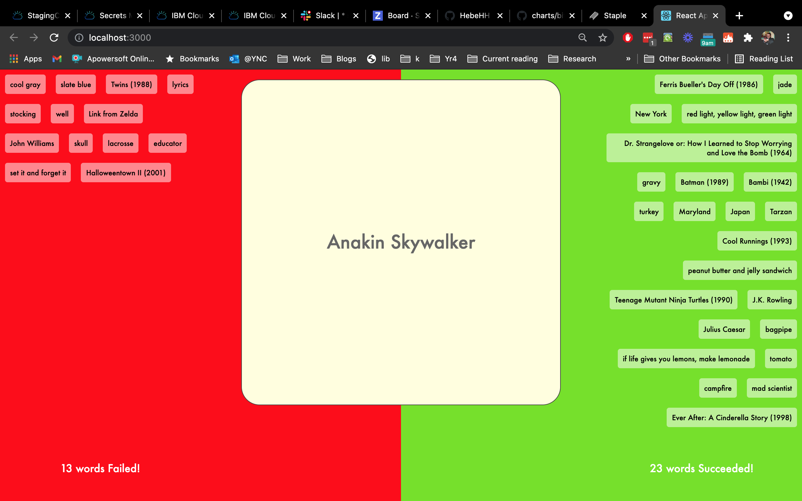

# Charades Game

A React app for playing Charades with your friends!

Provides the card prompts, score keeping.

## Quickstart

```bash
npm start
```

Automatically opens game in a new browser tab. Use the `left` and `right` arrow keys to discard played cards as either failures or successes, respectively.




## More Info

The game itself is decently self explanatory, I hope!

There's two main word lists available here; the default is `words.json`, which has more basic Charades items - movies, places, famous people. You can change this to `morewords.json` in the code (line 34), which has a bigger variety of words, more things, more conceptual stuff.

The game ends whenever either of the tracking areas (where completed words are stored) hits overflow, so the number of cards aren't consistent. Feel free to update this, but please play the game through and make sure it stays pretty.


<hr>


This project was bootstrapped with [Create React App](https://github.com/facebook/create-react-app).

